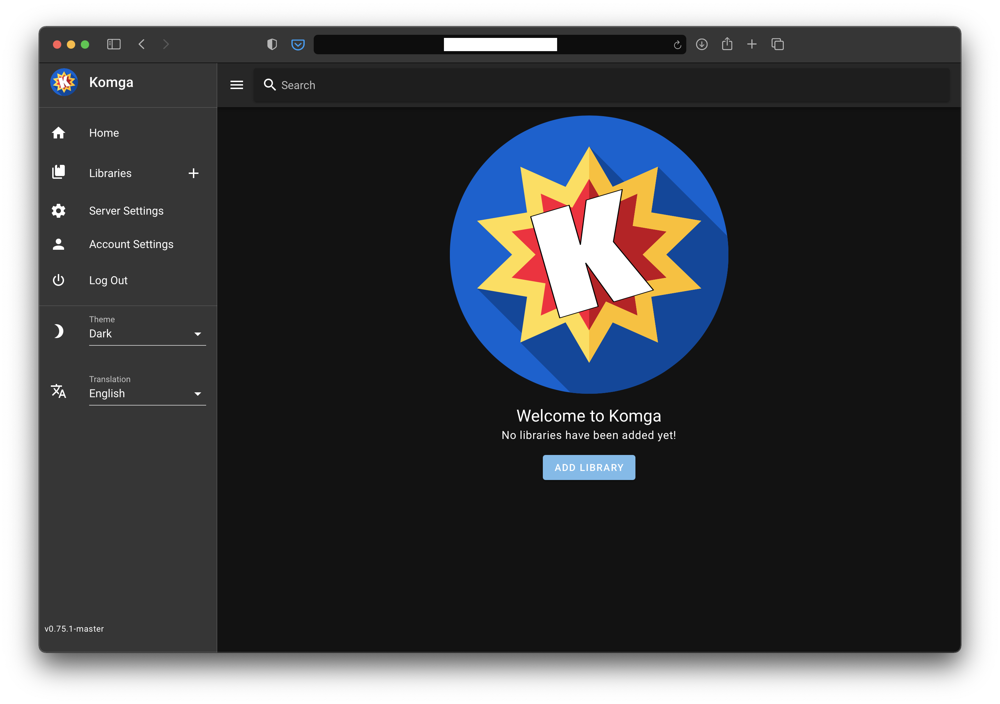

# Komga

[](https://dash.yunohost.org/appci/app/Komga)    
[](https://install-app.yunohost.org/?app=komga)

*[Lire ce readme en français.](./README_fr.md)*

> *This package allows you to install Komga quickly and simply on a YunoHost server.  
If you don't have YunoHost, please consult [the guide](https://yunohost.org/#/install) to learn how to install it.*

## Overview

Komga is a free and open source comics/mangas server.

Features include:

* Browse libraries, series and books
*  Search bar
* Download book files
* Manage multiple users, with per-library accesss control
* Webreader

**Shipped version:** 0.75.2

## Screenshots



## Demo

* [Official demo](https://demo.komga.org)

## Configuration

For most configurations, you can use the Admin panel in Komga.

## Documentation

 * Official documentation: Link to the official documentation of this app

## YunoHost specific features

#### Multi-user support

Are LDAP and HTTP auth supported? **No**
Can the app be used by multiple users? **Yes**

#### Supported architectures

* x86-64 - [](https://ci-apps.yunohost.org/ci/apps/REPLACEBYYOURAPP/)
* ARMv8-A - [](https://ci-apps-arm.yunohost.org/ci/apps/REPLACEBYYOURAPP/)

## Limitations

* None discovered yet.

## Links

 * Report a bug: https://github.com/YunoHost-Apps/komga_ynh/issues
 * App website: Link to the official website of this app.
 * Upstream app repository: Link to the official repository of the upstream app.
 * YunoHost website: https://yunohost.org/

---

## Developer info

Please send your pull request to the [testing branch](https://github.com/YunoHost-Apps/komga_ynh/tree/testing).

To try the testing branch, please proceed like that.
```
sudo yunohost app install https://github.com/YunoHost-Apps/REPLACEBYYOURAPP_ynh/tree/testing --debug
or
sudo yunohost app upgrade REPLACEBYYOURAPP -u https://github.com/YunoHost-Apps/komga_ynh/tree/testing --debug
```
